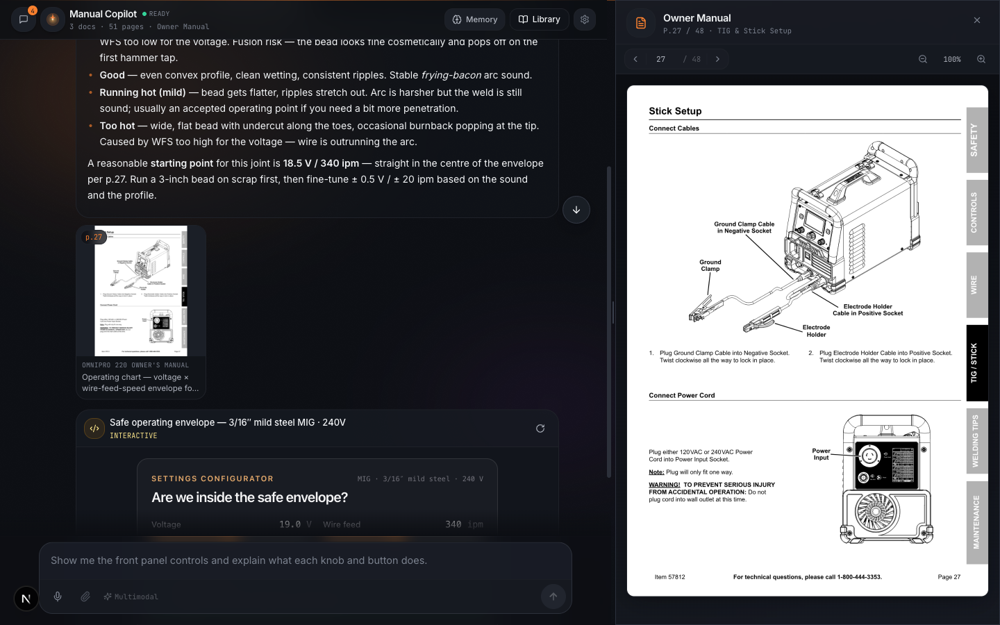
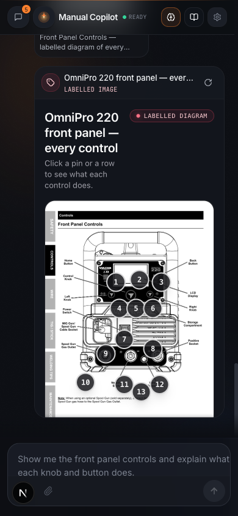
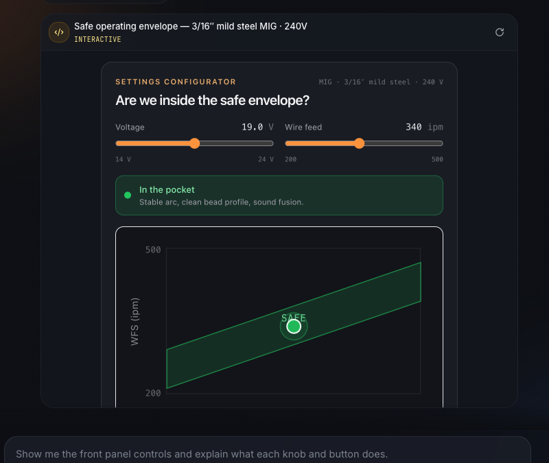
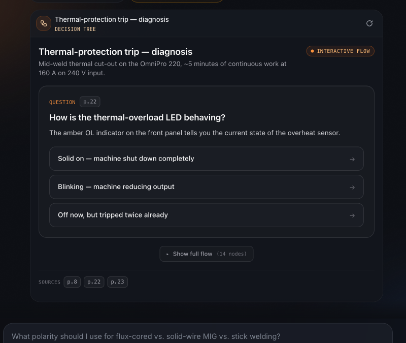
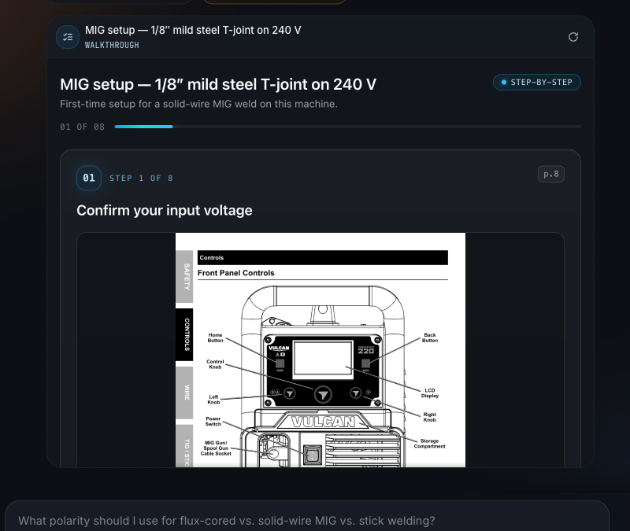
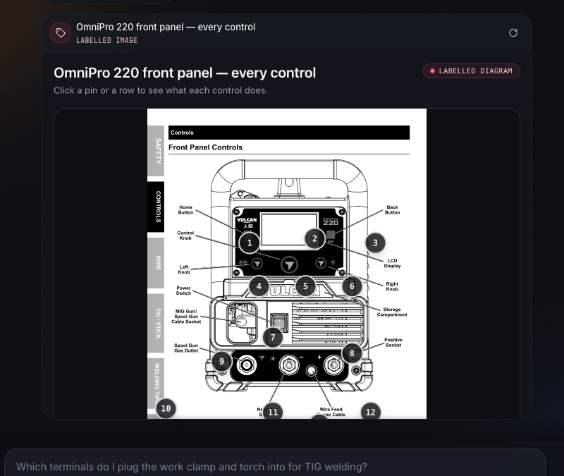
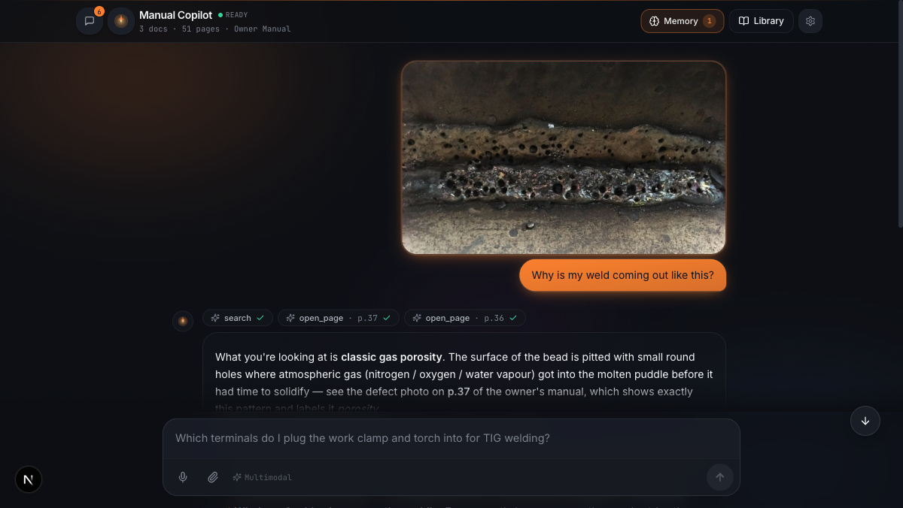
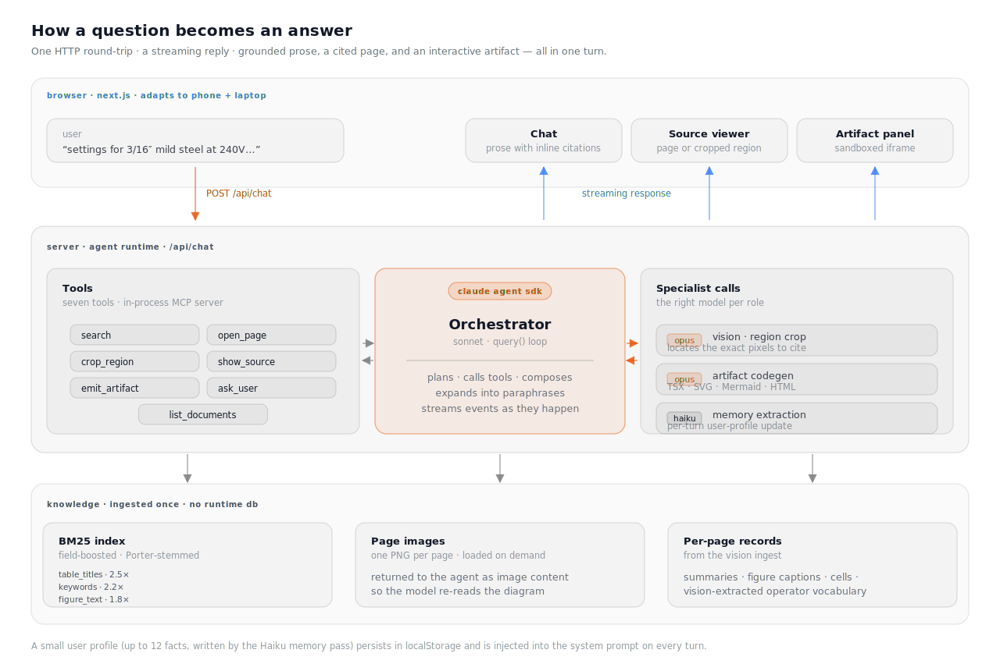
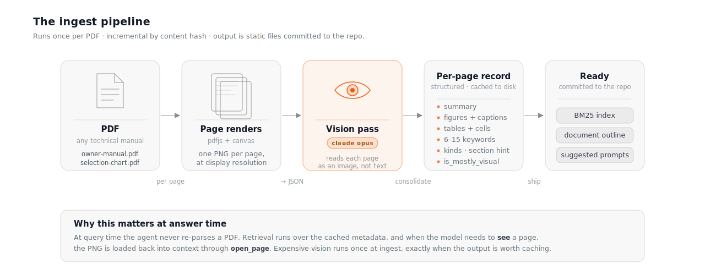

# Prox Hiring Challenge

**A multimodal reasoning agent for any technical product manual, at home on a phone or a laptop.** Drop a PDF into `files/`, run `npm run ingest`, and the same pipeline, the same tools, and the same UI light up around the new document — citing real pages, cropping the relevant regions of diagrams, and building interactive SVGs, flowcharts, and React calculators on demand. Built on the Claude Agent SDK.

> [!NOTE]
> **Nothing in this codebase is specific to the welder manual it ships with.** The demo corpus is a Vulcan OmniPro 220 owner's manual because that's what the challenge supplied. Swap it for a Tesla service manual, a Bambu P1S firmware guide, or an FAA airworthiness directive and the system works identically. No code changes, no config, no per-document prompts. Ingest, retrieval, the agent's tool set, the system prompt, and the UI are all document-agnostic by design.

The UI is built mobile-first, which matters because this is the device most users actually hold when they're standing in front of a machine they can't figure out. On phones, the chat runs full-width, artifacts render inline and reflow to fit, and the manual slides up as a bottom sheet the user can drag to dismiss — the same grounding, the same citations, the same interactive artifacts, re-flowed for one-handed use. On a laptop the sheet becomes a resizable right pane. Same code path; the shell adapts.


<p align="center">
  
  &nbsp;&nbsp;
  
</p>


*Same app at two viewports — laptop on the left, phone on the right. Artifacts reflow inline, sources dock as a right pane on desktop and a bottom sheet on mobile. Four demo conversations ship pre-seeded so a reviewer can explore without an API key.*

## Running it

```bash
git clone <this-fork>
cd prox-challenge
npm install
npm run dev
```

Open **[http://localhost:3000](http://localhost:3000)**. All three demo PDFs are pre-ingested and committed to the repo, so the first question works immediately — no ingest wait, no vector DB to provision, no model downloads. Four demo conversations (one per artifact kind) are also seeded into `localStorage` on first load, so a reviewer without an API key can still scroll through real answers, click citations, and poke the interactive artifacts before any agent call runs.

The Claude Agent SDK inherits auth from your local `claude` CLI, so if you're signed in via Claude Pro or Team there's no key to set. Otherwise put `ANTHROPIC_API_KEY` in `.env`, or paste a key into the in-app Settings dialog on first load — it stays in `localStorage` and is only sent in request headers, never persisted server-side.

## One question, end to end

The cleanest way to explain what this system does is to show a single question end-to-end. Here's a hard one:

> *"I want to weld 3/16″ mild steel T-joints on 240V. Give me a settings configurator: I slide voltage and wire speed and you tell me whether I'm in the safe envelope per the manual's chart, with the exact manual page cited at the boundary conditions. Then show me what a good bead at those settings looks like vs. too cold and too hot."*

One question, three jobs running in parallel. The agent has to read cell values from a chart in the manual, generate a parametric React artifact with sliders that respects the envelope those cells define, and surface the manual's own weld-quality photos — good bead, cold bead, hot bead — as visual evidence.

Here's what happens after the user hits enter.

**The orchestrator doesn't pass the user's phrasing straight to BM25.** It expands the question into 2–4 paraphrases — the user's wording, the manual's jargon form, abbreviations both spelled-out and contracted, compound questions split per topic — and dispatches all of them in one `search` call. *"3/16 mild steel T-joint 240V"* is joined by *"MIG operating envelope wire speed voltage"*, *"selection chart 0.1875 inch mild steel fillet"*, and *"duty cycle 240V"*. A garage-tone question gets to match a formal-tone manual because both vocabularies are searched at once. Results are merged per page with max-score fusion plus a small bonus for pages that rank under multiple paraphrases, so a page consistent across variants edges out one that spiked for a single phrasing.

**The page gets loaded as an image, not as text.** Retrieval returns page 27. The `open_page` tool encodes that page's PNG and sends it back into Claude's context — the model literally re-reads the chart as an image before writing a word of the answer. This is the part a text-only RAG pipeline fundamentally can't do: the vocabulary you needed to retrieve the right page is different from the information you needed to answer the question. A second call, `crop_region`, runs an Opus vision pass to locate the 240V / 3/16″ cell on page 27 and returns just that crop. Source cards under the prose show the crop thumbnail with a `⌖ region` badge; a click opens the full page in the right pane with the bbox highlighted in context.

**The artifact is written and rendered in the same turn.** The agent emits React TSX with two sliders, an envelope-check function seeded from the cells it just read, and boundary warnings that cite the manual page at the edges of the safe region. The browser transforms the TSX in-place with sucrase and loads it into a sandboxed iframe. No build step, no bundler, no server round-trip for the artifact — the code streams down alongside the prose, and the iframe runs it with `sandbox="allow-scripts"` and a null origin, so the worst-case failure is a broken render, never a broken app. If the render throws, the iframe posts the error back and the agent re-emits a v2 into the same card; the UI keeps v1 visible below so the user can see what changed.

**The bead references are drawn, not narrated.** At the bottom of the artifact, four small SVGs — *too cold*, *good*, *running hot*, *too hot* — preview the bead profile at each regime, and the one matching the current slider position highlights live. When a question specifically calls for the manual's own photographs instead (*"show me porosity versus undercut"* in a different demo thread, say), a parallel `show_source` call surfaces them as inline source cards, each clickable to pop open the full page. Two visual paths, same grounding story: what the user sees is either generated from code they can read or lifted verbatim from the manual.

**Prose ties it together, with inline citations that parse.** The agent writes in the same conversational register the system prompt asks for — someone explaining this to you in your garage, not a reprinted manual section. Page references like *"p.27"* and *"see the selection chart"* are detected by a parser in the client (not emitted as structured blocks) and turned into clickable chips. Click one and the source viewer jumps to that page. One rule in the system prompt, one parser in the client, no fragile schema in between.

### The four artifact kinds, each shown in a demo

The artifact system is kind-driven — the agent picks from a small, curated set (`react`, `svg`, `mermaid`, `flowchart`, `procedure`, `image-labeling`, `html`, `markdown`) based on what the answer actually needs. Each kind has its own rendering template; the agent just writes the payload. Four of them are showcased in the pre-seeded demos:


**Interactive React** — parametric tools. The envelope calculator reads cell values from the manual's operating chart, builds sliders around them, live-checks the operating point against the safe region, and color-shifts a status banner.




**Flowchart** — stateful decision trees. The thermal-protection troubleshooter branches on LCD behaviour and fan state, with a page citation on every leaf; clicking a branch advances through the tree.




**Procedure** — step-by-step walkthroughs. The MIG setup guide steps through eight stages with a page image inline at each step, progress indicator, and warnings flagged on the risky ones.




**Image labelling** — numbered pins overlaid on a real manual page. The front-panel demo uses p.8 of the owner's manual; hovering a pin or a description highlights the counterpart.




### Questions don't have to be text — attach a photo of the thing

The paperclip in the composer opens a real file picker; the image is encoded on the client, attached to the user turn, and sent to Claude as a content-block alongside the prompt. The same orchestrator + tools then run — the agent reads your photo with vision, searches the manual for the matching defect page, and diagnoses against the manual's own reference photos. A fifth pre-seeded demo thread (*Diagnose a bad weld from a photo*) shows the flow: a user drops in a picture of a porous weld and asks *"why is my weld coming out like this?"*; the assistant identifies classic gas porosity against p.37's defect reference and steps through the five most likely causes in order of likelihood, each cited to the manual page that covers the fix. This is the same vision pipeline the ingest side uses, just pointed at the user's photo instead of a manual page — a photo-in-hand troubleshooting loop the text-only version of this app couldn't close.




That's the full turn. What follows is how it works.

## Three decisions that compound

Every other choice in this system follows from three up-front commitments. Changing any one of them would force changes to the other two.

### 1. Vision-first, end to end

The hardest content in a technical manual isn't the text. It's the exploded-view diagrams, the wiring schematics, the labelled part photos, the decision matrices. Text-embedding RAG indexes PDFs as if they were articles; it skims past exactly the content that makes manuals useful.

So the pipeline is vision-first from ingest through answer. At ingest, every page goes through a Claude Opus vision pass. The output isn't OCR — it's a structured record: a 2–4 sentence page summary, figures with captions and per-figure keywords, tables with columns and cells, a `kinds` array (`schematic`, `photo`, `chart`, `visual`), a best-guess section hint, an `is_mostly_visual` flag, and six to fifteen operator-facing keywords per page. That record is cached to disk under `knowledge/` and the PDF is never re-read after ingest.

At answer time, `open_page` reverses the pipeline: the cached page PNG goes back into Claude's context so the model re-reads the diagram before writing the answer. The structured metadata drives retrieval; the image drives the actual reasoning. Running expensive vision at ingest and then only giving the model text at answer time would waste most of the ingest work at the moment it mattered most.

### 2. Grounded in pixels or in code the user can inspect

The agent answers in prose, but the prose isn't the whole answer. Two grounded output channels back it up, and each is checkable by a user who doesn't trust the model.

When a claim depends on the manual, the agent cites the page — and when the answer hinges on a specific region of a page (a dial, a socket, one row of a matrix), a vision call locates and crops to that region. The user is looking at the diagram, not reading a summary of it. When the answer is structural — a branching troubleshooting tree, a parametric calculator, a step-by-step walkthrough, a labelled diagram — the agent picks an artifact kind from a small curated set (React TSX, SVG, Mermaid, HTML, plus JSON-driven templates for flowcharts, procedures, and image-labelling) and the browser renders it in a sandboxed iframe. The generated code is as auditable as the artifact it produces; open devtools and read it.

Either the answer is pinned to the real document, or it's expressed in code the user can inspect. Unsourced prose on trust is the failure mode the whole design is built to avoid.

### 3. An orchestrator with tools, with the right model per role

The runtime is a Claude Agent SDK `query()` loop with seven tools: `list_documents`, `search`, `open_page`, `crop_region`, `show_source`, `emit_artifact`, and `ask_user`. A lean Sonnet orchestrator plans, calls tools, and composes the final answer.

This is the opposite of the "paste the whole manual into context and ask" pattern, and it wins for three reasons. **Groundedness:** the manual isn't in the orchestrator's context, so the only way to answer a spec question is to retrieve it — which is the only channel that can be audited. **Determinism:** same question, same corpus, same answer shape. Tools are pure functions over indexed data; the agent operates on a structured knowledge base rather than a blurry mental map of the PDF. **Model specialization:** one model doesn't fit every task.


| Role                            | Default | Why                                                                    |
| ------------------------------- | ------- | ---------------------------------------------------------------------- |
| Ingest — per-page vision        | Opus    | One-shot, quality-critical. Wrong metadata poisons every future query. |
| Ingest — document consolidation | Opus    | Outline + suggested prompts; precision matters.                        |
| Chat orchestrator               | Sonnet  | Latency-sensitive. The user is waiting on every turn.                  |
| Vision crop / region locate     | Opus    | Bounding-box precision on dense diagrams.                              |
| Artifact code generation        | Opus    | Quality beats latency for rendered output.                             |
| Memory extraction               | Haiku   | High-frequency, per-turn, small deltas. Latency and cost dominate.     |


Each role is individually overridable via `MODEL_ROLE_`* env vars, or per-request from the in-app Settings dialog. The user pays for precision only where the task demands it.

## The shape of the system

Zooming out, three layers talk to each other over a single streaming HTTP response. The client shows the conversation and whatever the agent surfaces; the agent plans and calls tools; the knowledge layer is a set of static files that were written once, at ingest time, and never touched again at runtime.



The chat transport streams everything down a single HTTP response — text deltas, tool-call lifecycle events, source citations, artifact emissions, disambiguation asks — so the UI can update progressively as the agent works, rather than waiting for a final reply.

## The ingest pipeline

Ingest runs once per PDF and is fully generic. `npm run ingest` is incremental by content hash; `npm run ingest:force` re-runs everything from scratch.



A 50-page technical manual takes five to ten minutes to ingest end-to-end on Opus, dominated by the vision pass. Re-runs pick up only new or hash-changed pages. The finished index for the shipped demo corpus is a 236 KB JSON bundle — it ships in the repo, which is why the first question works in under a minute on a fresh clone.

## Retrieval: BM25 plus three cheap ideas that replace a vector DB

Retrieval is BM25 via `minisearch`. No vector DB, no embeddings, no reranker. This is a deliberate subtraction, but the reason it works isn't "BM25 is fine at this scale." It's that three composed ideas cover the ground a vector DB is usually brought in to cover.

**The index doesn't just hold OCR — it holds a vision-extracted vocabulary layer.** Every page goes through a one-time Opus vision pass that emits, alongside a summary, six to fifteen operator-facing keywords: the jargon, part names, error codes, and process names an operator would actually search for. Figure captions and table titles get the same treatment. Those land in separate index fields with their own boosts:


| Field          | Boost | What's in it                                                 |
| -------------- | ----- | ------------------------------------------------------------ |
| `table_titles` | 2.5×  | Titles of duty-cycle charts, selection charts, torque tables |
| `keywords`     | 2.2×  | Vision-extracted operator jargon per page                    |
| `summary`      | 2.0×  | 2–4 sentence page summary                                    |
| `figure_text`  | 1.8×  | Figure captions + per-figure keywords                        |
| `figure_kinds` | 1.5×  | `schematic`, `photo`, `chart`, `visual`                      |
| `table_text`   | 1.4×  | Table columns + cells                                        |
| `section_hint` | 1.1×  | Best-guess chapter/section name                              |
| `text`         | 1.0×  | Raw OCR text                                                 |


This is the part most BM25 comparisons miss. Plain BM25 on raw OCR underperforms for a reason: it's only indexing what the PDF happens to have as selectable text, and on a diagram-heavy manual that's half the document. Here the LLM has already read each page as an image and tagged it with the search vocabulary an operator would use, so by the time BM25 runs, the index has already absorbed a big chunk of what an embedding model would otherwise have to infer at query time.

**Stemming folds morphology at both ends.** A shared `processTerm` (lowercase plus Porter stemmer, skipping short all-caps codes like `DCEP`, `FCAW`, `MIG`) runs at index-time and query-time inside `minisearch`, so `welding`, `welded`, `welds`, and `weld` collapse to the same root. Paired with `prefix: true` to catch longer derivations the stemmer leaves alone, and `fuzzy: 0.15` edit-distance to absorb typos. One function, one tokenizer pipeline, used everywhere.

**The agent expands every question into paraphrases before BM25 runs.** The `search` tool takes `queries: string[]`, not one string. The orchestrator is instructed to generate two to four variants covering the user's verbatim phrasing, the manual's formal form (`stick welding` → also `SMAW`, `shielded metal arc welding`), abbreviations expanded and contracted (`AC balance` → also `alternating current balance`), and compound questions split per topic. Each variant is scored independently; pages are merged by `doc#page` with max-score fusion plus a small multi-hit bonus — 1.15× for two paraphrases, 1.25× for three or more — so a page that ranks under every paraphrase edges out one that only showed up for a single variant. This is where colloquial queries stop whiffing against formal-tone manuals.

Dense retrieval would solve exactly one problem these three don't: the vocabulary gap between a user's phrasing and the document's. That gap is closed up-front — at ingest with Opus-extracted keywords, and at query time with agent-side paraphrase — at the two points where the signal is cheap and interpretable. Adding a vector store on top would be paying for the same coverage twice, and would add version skew between the embedding model and the index as a new failure mode. BM25 matches are explainable token-by-token (`"capacitor"` ranked p.27 because it hit the `keywords` field at 2.2× and a figure caption at 1.8×); dense similarity in a 1536-dimensional space isn't something you can debug over coffee. At ten documents or ten thousand pages, or a corpus where `is_mostly_visual` pages dominate and the text-indexable vocabulary is genuinely thin, I'd add a dense retriever as a second stage and rerank the union — not as a replacement, as a belt-and-braces layer.

Field boosts are a tunable knob, not a fixed formula. If a new corpus routes more information through tables, bump `table_titles` and re-ingest. The ingest script rebuilds the index from the cached per-page JSON without re-running vision, so the cost of tuning is seconds, not minutes.

## Artifacts: no build step, sandboxed by default

Every generated artifact — React TSX, SVG, Mermaid, HTML, or a JSON payload rendered by one of the built-in templates (flowchart, procedure, image-labelling) — is loaded into one static `artifact-runner.html` page running inside an iframe with `sandbox="allow-scripts"`. Null origin, no cookies, no access to the user's localStorage or the host app's APIs. React, Tailwind, recharts, and mermaid come from `esm.sh` via an import map; TSX is transformed in-browser by **sucrase**, which is five to ten times faster than `babel-standalone` and purpose-built for runtime JSX and TypeScript stripping.

Three properties fall out of this. There's no build step for generated code — the agent emits it and the iframe renders it. The sandbox boundary caps the worst case at a broken render, not a broken app. And because the iframe posts render errors back to the host, the agent can re-emit a corrected version into the same card; the UI stacks the versions so v1 and v2 sit side by side for comparison.

Constraining artifacts to a small, known set of kinds is itself a design choice. It keeps the artifact-author prompt crisp — no "three.js or canvas?" ambiguity — and forces polish within a known substrate.

## What the agent remembers about you

Threads and a small per-user profile persist in `localStorage` — no backend, no account, no network hop. Reload the tab or come back tomorrow and state comes back with you. Each conversation is a saved thread with its own messages and artifacts; threads can be renamed, searched, or deleted, and are capped at the forty most-recently-updated. A server-side 16-turn sliding window keeps prompt size bounded regardless of thread length.

After each turn, a Haiku pass reads the exchange against the existing profile and returns an updated list of durable facts — the user's machine model, their skill level, their voltage, their material. Overlapping facts are merged in place rather than appended as variants, and the total is capped at twelve. The profile is injected into the system prompt separately from message history, so long-range recall doesn't consume conversational context. Every fact is visible and editable from the Memory dialog; the assistant never knows anything about the user that the user can't inspect, overwrite, or clear.

## Using it with your own manuals

```bash
cp my-device-manual.pdf files/
npm run ingest         # incremental — only new / changed files
npm run dev
```

The new manual joins whatever is already in `knowledge/`, shows up in the library drawer, contributes auto-generated suggested prompts on the welcome screen, and becomes part of the agent's retrieval scope. No code changes, no config.

```bash
npm run ingest:force   # re-ingest everything from scratch
```

Models are overridable at every level. Fleet-wide defaults come from `CLAUDE_MODEL` and `INGEST_MODEL`; per-role overrides (`MODEL_ROLE_QA_ORCHESTRATOR`, `MODEL_ROLE_QA_ARTIFACT`, `MODEL_ROLE_INGEST_VISION`, and others) take priority over those. The in-app Settings dialog lets you pick per-request models and paste a per-session API key without touching `.env`.

## A note on what's not here

A backend database, in-app PDF upload, voice, and web search are left out of the demo. In production:

- **Persistence** — Postgres behind auth replaces `localStorage`.
- **In-app upload** — drag-and-drop replaces the `files/ → npm run ingest` CLI.
- **Voice** — a hands-free loop; sketched below.
- **Web search** — intentionally omitted. The thesis is *"every claim is grounded in the document you uploaded,"* and web results would undermine that.

## What I'd build next

The next steps are a hands-free voice loop (Whisper in, browser TTS or ElevenLabs out, riding the same stream the agent already uses for tool events); live video diagnosis — the user points their phone at the machine, frames stream up, the agent watches and talks back, closer to a video call with someone who's read the manual than a chat; Behind those, an eval harness, observability, and cross-document routing.

---

