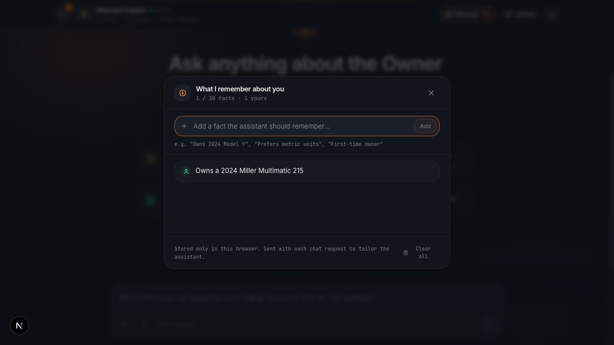

# Manual Copilot

> **This project is fully generic.** No code, prompt, tool, or heuristic is specific to the manual it ships with. The welder owner's manual in `files/` is a demo corpus — swap it for any PDF and the exact same pipeline, agent, and UI light up around the new document with zero code changes. Ingest, retrieval, tools, system prompt, and UI are all document-agnostic by design.

A multimodal reasoning agent for technical product manuals, built on the **Claude Agent SDK**. Drop any PDF in, run ingest, and you get a chat interface that answers questions with real page citations, cropped diagrams, and interactive artifacts (SVGs, flowcharts, parametric calculators) rendered live in the browser.

## Run it

```bash
npm install
npm run dev
```

Open **http://localhost:3000**. The demo corpus is pre-ingested and committed, so the first question works in under a minute.

**Auth.** The Claude Agent SDK inherits auth from your local `claude` CLI — if you're signed in via Claude Pro/Team, no key is needed. Otherwise set `ANTHROPIC_API_KEY` in `.env`, or paste a key into the Settings dialog on first load.

## Design philosophy

Three arguments drive every other decision in the system. Changing any one of them would force changes to the other two — they compound.

### 1. Vision-first, end to end — not text-first RAG

The hardest content in a technical manual isn't the text. It's the exploded-view diagrams, the wiring schematics, the labeled part photos, the decision matrices. Text-embedding RAG indexes PDFs as if they were articles; it skims past exactly the content that makes manuals useful.

So the pipeline is vision-first from ingest through answer:

- **Ingest** runs a vision pass per page with Claude Opus. The output isn't OCR — it's a structured record (summary, figures with captions, tables with rows, keywords, *is this page mostly visual?*) that captures what the **image** contains, not just what text happens to be copy-pasteable.
- **At answer time, the `open_page` tool returns the page image back into the agent's context.** Claude literally re-reads the diagram before writing the answer. Text-only retrieval would have made the expensive vision ingest pointless at the moment it matters most.

Ingest-time vision analysis runs once per document and the structured output is cached to disk. Retrieval, ranking, and the document outline all operate on that cached metadata — the PDF is never reprocessed after ingest. At answer time, `open_page` sends the page image back into the agent's context, because that's the whole point: the model re-reads the diagram before writing the answer.

### 2. Grounded in pixels or auditable code — never just prose on trust

The agent answers in prose, and backs that prose with two grounded output channels. Each one solves a different job, and each one is checkable by a user who doesn't trust the model:

- **Pinpoint visual citations.** When a claim comes from the manual, the agent surfaces the exact page — and when the answer hinges on a specific region (a dial, a socket, one row of a matrix), a vision call locates and crops to that region. The user isn't reading a summary of the diagram; they're looking at the diagram, pinned to the sub-pixel the model used.
- **Interactive code artifacts.** When the answer is structural — a branching troubleshooting tree, a duty-cycle calculator, a reproduced wiring diagram — the agent writes SVG / Mermaid / HTML / React TSX, and the browser renders it in a sandboxed iframe. The generated code is as auditable as the artifact it renders; the user can open devtools and read it.

Either the answer is pinned to the real document, or it's expressed in code the user can inspect.

### 3. Orchestrator + tools, with model specialization per role — not one-shot prompt stuffing

The runtime is a Claude Agent SDK `query()` loop with seven curated tools (search, open page, crop region, show source, emit artifact, ask user, list documents). A lean Sonnet orchestrator plans, calls tools, and composes the final answer.

This is the opposite of the "paste the whole manual into context and ask" approach. Three reasons it wins:

- **Groundedness.** The manual isn't in the orchestrator's context. The only way to answer a spec question is to retrieve it — which is the only channel we can audit.
- **Determinism.** Same question, same ingested corpus, same answer shape. Tools are pure functions over indexed data. The agent isn't improvising over a blurry mental map of the PDF; it's operating over a structured knowledge base.
- **Model specialization per role.** One model doesn't fit every task:

| Role | Default | Why |
|------|---------|-----|
| Ingest — per-page vision | Opus | One-shot, quality-critical. Wrong metadata poisons every future query. |
| Ingest — document consolidation | Opus | Synthesize outline + suggested prompts; precision matters. |
| Chat orchestrator | Sonnet | Latency-sensitive. Users are waiting on every turn. |
| Vision crop / region locate | Opus | Bounding-box precision on dense diagrams. |
| Artifact code generation | Opus | Quality > latency for rendered output. |

Each role is individually overridable (`MODEL_ROLE_*` env vars, or per-request from the Settings dialog). The user pays for precision only where the task demands it.

## Why these specific technical choices

### Retrieval: BM25 + LLM-expanded vocabulary + stemming + agent-side paraphrase, not vector RAG

Retrieval is BM25 via minisearch. No vector DB, no embeddings, no reranker. This is a deliberate subtraction — but the reason it works isn't "BM25 is fine at this scale." It's that four cheap ideas, composed, cover the ground vector RAG is usually brought in to cover.

**1. The index doesn't just hold OCR — it holds a vision-extracted vocabulary layer.**
Every page goes through a one-time Opus vision pass that emits (alongside a summary) 6–15 operator-facing **keywords** — the jargon, part names, error codes, and process names an operator would actually search for. Figure captions and table titles get the same treatment. Those land in separate index fields with their own boosts:

| Field | Boost | What's in it |
|---|---|---|
| `table_titles` | 2.5× | Titles of duty-cycle charts, selection charts, torque tables |
| `keywords` | 2.2× | Vision-extracted operator jargon per page |
| `summary` | 2.0× | 2–4 sentence page summary |
| `figure_text` | 1.8× | Figure captions + per-figure keywords |
| `figure_kinds` | 1.5× | `schematic`, `photo`, `chart`, `visual`/`diagram` |
| `table_text` | 1.4× | Table columns + cells |
| `section_hint` | 1.1× | Best-guess chapter/section name |
| `text` | 1.0× | Raw OCR text (base) |

This is the part most BM25 comparisons miss. "Plain BM25 on raw OCR" underperforms for a reason — it's only indexing what the PDF happens to have as selectable text, and on a diagram-heavy manual that's half the document. Here the LLM has already read each page as an image and tagged it with the search vocabulary an operator would use, so by the time BM25 runs, the index has already absorbed a big chunk of what an embedding model would otherwise have to infer at query time.

**2. Stemming folds morphology at both ends.**
A shared `processTerm` (lowercase + Porter stemmer, skipping short all-caps codes like `DCEP`/`FCAW`) runs at index-time AND query-time inside minisearch, so `welding`, `welded`, `welds`, and `weld` collapse to the same root. Paired with `prefix: true` (catches longer derivations the stemmer left alone) and `fuzzy: 0.15` (edit-distance 0.15 to absorb typos). One function, one tokenizer pipeline, used everywhere. See `lib/kb/search.ts`.

**3. The agent expands every question into 2–4 paraphrases before it hits BM25.**
The `search` tool takes `queries: string[]`, not one string. The orchestrator is instructed to generate paraphrases: the user's verbatim wording, the manual's jargon form (`stick welding` → also `SMAW`, `shielded metal arc welding`), abbreviations both expanded and contracted (`AC balance` → also `alternating current balance`), and compound questions split per-topic. Each paraphrase is scored independently; results are merged by `doc#page` with **max-score fusion** plus a small multi-hit bonus (1.15× for 2 paraphrases, 1.25× for 3+) so a page that ranks under every paraphrase edges out one that only showed up for a single variant. This is where colloquial queries stop whiffing against formal-tone manuals. See `hitsFromQueries` in `lib/kb/search.ts`.

**4. Field boosts are a tunable knob, not a fixed formula.**
If a new corpus routes more information through tables, bump `table_titles`. If a manual uses a lot of labeled photos, bump `figure_text`. No re-encoding. Just change a number and re-ingest (the ingest script rebuilds the index from cached per-page JSON — no re-running vision).

**Why not vector embeddings + RAG:**

- **Scale.** At ~50 pages × 3 documents, the index is a 236 KB JSON bundle that ships in the repo. A vector store is more moving parts than signal at this size — provisioning, eventual consistency, version skew between the embedding model and the index, a new failure mode for something users already expect to just work.
- **Groundedness.** BM25 matches are explainable token-by-token. `"capacitor"` ranked p.27 because it hit the keywords field (2.2×) and a figure caption (1.8×). With dense retrieval, "this page is near that query in a 1536-dim space" isn't something you can debug over coffee — you'd end up running a reranker to audit the retriever.
- **Determinism.** Same query today, same ranking tomorrow. No float drift, no quiet behavior shift when a provider ships a new embedding model.
- **User vocabulary.** Manuals use a tight domain vocabulary — the user usually types what's stamped on the machine. Semantic similarity buys its keep on open-domain prose; it buys much less when the query overlap is already literal.
- **The vocabulary gap is the one real case for dense retrieval, and we cover it at ingest.** Embeddings mostly shine when the user's phrasing diverges from the document's. We absorb that gap up front with per-page Opus-extracted keywords and at query-time with agent-side paraphrase — the two places where the signal is cheap and interpretable. Bolting on a vector index would be paying for the same coverage twice.
- **Latency and cost.** BM25 search is sub-millisecond in-process, no network hop. Ingest is one-shot per PDF, already amortized. Every vector RAG system I've seen adds either latency (remote DB) or build complexity (embedded store, re-encode on model rev) with no accuracy win on this corpus shape.

**When we'd reconsider:** 10+ documents, 10k+ pages, or a corpus where `is_mostly_visual` pages dominate and the text-indexable vocabulary is genuinely thin (poetry-heavy marketing collateral, hand-drawn repair sketches). At that point you'd add a dense retriever as a second stage and rerank the union — not as a replacement for BM25, as a belt-and-braces layer on top.

### SSE over WebSocket

The chat transport is Server-Sent Events. The server streams multiple event types — text deltas, tool lifecycle, source citations, artifact emissions, disambiguation asks — down a single HTTP response. The next user message is a new POST.

WebSockets offer a bidirectional channel we don't need. SSE works through every CDN and reverse proxy without upgrade negotiation, the browser `EventSource` API is trivial, and reconnection semantics are well-defined. For a one-way stream of LLM output and tool events, SSE is the right amount of protocol.

### Sandboxed iframe + sucrase, not a Vite bundle

Generated artifacts are React TSX, HTML, SVG, or Mermaid. They run in one static `artifact-runner.html` page, loaded into an iframe with `sandbox="allow-scripts"` — null origin, no cookies, no same-origin privileges. React / Tailwind / recharts / mermaid are loaded from esm.sh via an import map; TSX is transformed in the browser with **sucrase**, which is 5–10× faster than babel-standalone and purpose-built for runtime JSX/TS stripping.

Merits:

- **No build step for generated code.** The agent emits code, the iframe renders it. There's no "package and deploy the artifact" pipeline.
- **Sandboxed origin.** An artifact can't exfil cookies, hit the manual's APIs, or read the user's localStorage. The worst-case failure is a broken render, never a broken app.
- **Auto-fix on error.** If an artifact throws, the iframe posts the error back, and the agent re-emits a corrected version into the same slot. The UI stacks versions so the user can compare v1 and v2.

Constraining artifacts to a small, known set of kinds is itself a design choice: it keeps the artifact-author prompt crisp (no "three.js or canvas?" ambiguity) and forces polish within a known substrate.

### Citations are parsed, not templated

The agent is told to cite sources in its prose. The UI scans the rendered answer for citation shapes and turns each into a clickable chip that opens the source viewer at that page. The agent doesn't have to emit structured citation blocks, and the parser is resilient to whatever natural form the model picks. One rule in the system prompt, one parser in the client — no fragile schema between them.

## How the pieces fit

```
Ingest (one-time per PDF, fully generic)
  PDF ─▶ pdfjs + canvas ─▶ page PNGs
                │
                ▼
        per-page vision pass (Opus)
                │
                ▼
        consolidation pass (outline + suggested prompts)
                │
                ▼
        BM25 index (stemmed, field-boosted) + page metadata + suggested prompts
                │
                ▼
        committed to the repo; no DB needed

Runtime (Next.js, single process)
  Chat UI ◀─SSE─ /api/chat
                   │
                   ▼
           Agent SDK query()
           Sonnet orchestrator
            ┌─────────────────┐
            │ in-process MCP: │
            │  search         │──▶ 2–4 paraphrases ─▶ BM25 ─▶ merged
            │  open_page(s)   │──▶ image back into agent context
            │  crop_region    │──▶ Opus vision
            │  show_source    │──▶ UI source panel
            │  emit_artifact  │──▶ Opus codegen ─▶ sandboxed iframe
            │  ask_user       │──▶ UI quick-reply
            │  list_documents │
            └─────────────────┘
```

The right-hand pane of the UI swaps between a **source viewer** (the cited page, with optional crop overlay) and an **artifact panel** (the sandboxed iframe). Citations in the agent's prose are auto-linked; clicking one opens the source panel at that page.

## Conversation memory

Threads and a small per-user profile persist in `localStorage` — no backend, no account, no network hop. Reload the tab or come back tomorrow and state comes back with you.

- **Threads.** Each conversation is a saved thread with its own messages and artifacts. Create, rename, delete, search. Capped at the 40 most-recent-updated; a server-side 16-turn sliding window keeps context bounded regardless of thread length.
- **Memory.** A tiny profile of durable facts about the user — their model, skill level, preferences, constraints. After each turn a Haiku pass reads the exchange against the existing profile and returns an updated list under a hard cap of 12, merging overlapping facts in place rather than appending variants. The profile is injected into the system prompt separately from message history, so long-range recall doesn't consume conversational context.

Every fact is visible and editable in the UI. The assistant never knows anything about you that you can't inspect, overwrite, or clear.

<p align="center"></p>

## Using it with your own manuals

```bash
cp my-device-manual.pdf files/
npm run ingest         # incremental — only new/changed files
npm run dev
```

The new manual joins whatever is already in `knowledge/`, shows up in the library drawer, contributes suggested prompts, and becomes part of the agent's retrieval scope. No code changes, no config.

```bash
npm run ingest:force   # re-ingest everything from scratch
```

## Running against a different model

```bash
CLAUDE_MODEL=opus      npm run dev       # orchestrator, fleet-wide
INGEST_MODEL=sonnet    npm run ingest    # ingest, fleet-wide

# Per-role overrides take priority:
MODEL_ROLE_QA_ORCHESTRATOR=opus
MODEL_ROLE_QA_ARTIFACT=sonnet
```

The Settings dialog in the UI also lets you pick per-request models and paste a per-session API key without touching `.env`.
